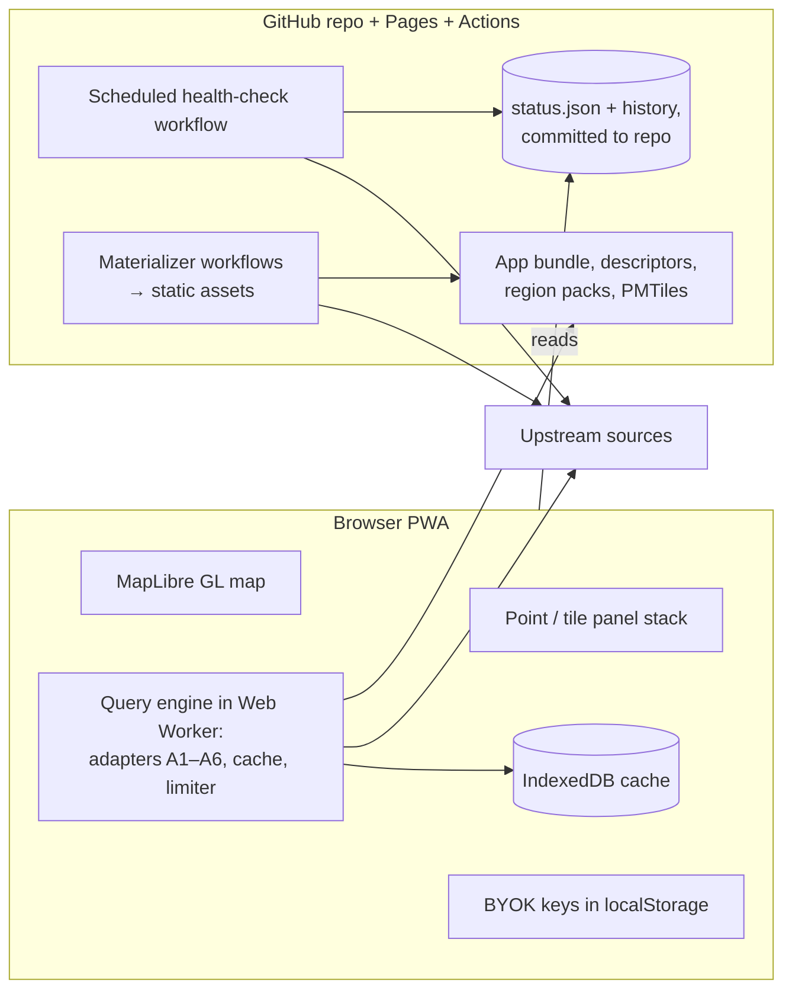

# Strata — Technical Plan
**Status:** v0.4, in effect (companion to [requirements.md](requirements.md) draft v0.3)
**Date:** 2026-08-16
**Changed in v0.2:** architecture revised from thin-server-proxy to client-only after re-examination (see §1 and decisions.md D1); Phases 1–4 detailed (§8); requirements deviations forced by client-only recorded (§5).
**Changed in v0.3:** decisions D1–D9 accepted by the author; D1 carries a rider — keep a later proxy switch contained — implemented as §4.5.
**Changed in v0.4:** Phase 0 hardening records browser-aware health, the Energy-Charts materialization, PWA/BYOK/browser regression gates, and the explicit WorldCover capability gap (§6.2).

This document turns the requirements into buildable decisions: architecture shape, stack, repository layout, core contracts, and a work breakdown for all phases. Positions on the open decisions of requirements §12 live in [decisions.md](decisions.md); this plan assumes the recommendations there and must be revised if they change.

---

## 1. Architecture shape: client-only

**Strata is a static web app. There is no server and no database.** Everything Strata runs is either JavaScript in the browser or a scheduled GitHub Actions workflow; durable state lives in the browser (IndexedDB, localStorage), the repository (health history), or the immutable Pages deployment artifact (refreshed materializations). Hosting is GitHub Pages by default. The app is a PWA, which is also most of the offline story (D6).



### 1.1 Why the proxy lost

Plan v0.1 recommended a thin server proxy, on four arguments. Re-examined for a **single-operator** instrument, each dissolves:

| Proxy argument | Client-only answer |
|---|---|
| Central rate limiting across tabs (R7.3) | The limiter lives in the query engine worker; the Web Locks API coordinates the rare second tab. One person clicking one map is the load model — the 30-layer fan-out hazard is already contained by lazy fetch (R7.1) and debounce (R7.4), which are client-side anyway. |
| Scheduled health checks with nobody watching (R8.2) | A **GitHub Actions cron workflow** runs the same isomorphic core (descriptor loader → query pipeline → assertion) in Node, verifies browser CORS/Range/freshness separately, and commits `status.json` plus an append-only history file to the repo. R8.5's "when did this break" history comes free from git. The client reads the committed status and active queries still surface their own failures. |
| API keys can't ship in a client bundle | Keys don't ship — **bring-your-own-key**: the operator pastes their free personal keys (FIRMS, eBird, ENTSO-E, OpenCellID, aisstream) into a settings panel once; they live in localStorage. The Actions health runner uses repo secrets for the same layers. For a personal instrument this is cleaner than hiding shared keys behind a proxy. |
| CORS | The one real casualty — see §1.2. Not all upstreams allow browser access, and no client-side cleverness changes that. |

What the client-only shape buys in exchange: zero hosting cost, zero operations, no standing process to babysit for Phases 0–2 (exactly matching the requirements' observation that adapters A1–A4/A6 are stateless and on-demand), an offline story that falls out of the PWA architecture instead of fighting the proxy, and an app anyone can open from a URL against their own keys.

### 1.2 The three honest costs

1. **CORS-blocked sources.** A browser can only query endpoints that send CORS headers (and, for COG range reads, allow the `Range` header). Much of the core catalogue is fine — Overpass, Wikidata SPARQL, Open-Meteo, USGS, GBIF, GIBS, AWS-hosted COGs are browser-friendly — but national INSPIRE/WFS services and assorted government APIs will be patchy, and this is discoverable only per-layer. Consequently **CORS verification joins the §13 checklist** (see §5). The mitigation ladder, in order:
   1. *Accept the loss.* Coverage is permanently uneven by design.
   2. *Materialize via Actions* (§1.3) — for slow-changing sources this is often *better* than live queries.
   3. *A minimal CORS/key shim* (e.g. a single Cloudflare Worker, no state) — kept as a named escape hatch, not built until a specific must-have layer forces it. Adding it later changes one descriptor field (`endpoint`), not the architecture.
2. **Streams are live-while-watching.** With no standing process, the A5 state buffer exists only while the tab is open: no backfill, no history, no observation while away. For watching aircraft, lightning, ships, and earthquakes live, this is fine — that is how the instrument is actually used. What it forecloses is the **derived ADS-B analytics of requirements §9, derivation 5** (runway-in-use, holding patterns, transponder gaps), which need continuous observation. That work was already conditional and Phase-3-gated; it now additionally requires the backend-revisit decision of §9 to go the other way first. Recorded in D8.
3. **Politeness identification is weaker.** Browsers cannot set `User-Agent` (it is a forbidden header), so R7.5 as written is unsatisfiable from the client. The `Origin`/`Referer` headers do identify the app, the app's public URL carries contact details, and query-parameter identification is used where providers support it. MET Norway, which *requires* identifying UA headers, is dropped in favour of Open-Meteo (which is explicitly browser-friendly) — or reached via the Actions health runner/materializer only, where UA can be set. Recorded as a requirements deviation in §5.

### 1.3 The materializer pattern

A scheduled GitHub Actions workflow that fetches an upstream source, validates/transforms it, and publishes the result as a static Pages asset (JSON, FlatGeobuf, or PMTiles). Frequently refreshed small assets can live only in the immutable deployment artifact; durable or large derived products can be committed or attached to Releases. This converts sources that are CORS-blocked, slow, bulk-download-only, or impolite to hammer into browser-safe materialized inputs — and it reuses the same adapter code the client runs, since `packages/core` is isomorphic. The first production use is Energy-Charts: an hourly versioned JSON envelope with explicit materialized/source timestamps. Later candidates: city tree cadastres (yearly), IACS crop parcels (yearly), UK/FR property transactions (monthly bulk CSVs), Pleiades/DARE gazetteers (rarely), Ookla (quarterly), region packs themselves. The derivation provenance rule (R9.2) applies.

This is the second job Actions does (health checks being the first). Both are "server-shaped work without a server": scheduled, unattended, versioned, free at this scale.

## 2. Stack

**TypeScript everywhere; `packages/core` is isomorphic** (runs in the browser worker *and* in Node under Actions — the health runner and materializers are consumers of the same adapters, which keeps them honest).

| Concern | Choice | Why |
|---|---|---|
| Map rendering | **MapLibre GL JS** | Open-source vector-tile WebGL renderer; the default for OSM-based work |
| Basemap | OpenFreeMap tiles or self-hosted Protomaps PMTiles | No key, no terms to babysit; PMTiles basemap also serves the offline path |
| App framework | **Svelte 5 + Vite**, PWA via service worker | Small, fast; the heavy lifting is MapLibre's and the worker's |
| Query engine | **Web Worker** hosting adapters, cache, limiter | Keeps parsing/aggregation off the UI thread; single chokepoint for politeness |
| Descriptor validation | **Zod** schemas, descriptors authored in YAML | Load-time mandatory-field enforcement (R6.2/R6.3) plus inferred TS types shared everywhere — the contract cannot drift |
| COG reading (A2) | **geotiff.js** | Pure-JS range-request COG reads, browser-native |
| Reprojection | **proj4js**, definitions pinned per descriptor | R8.4: descriptor `crs` is the only source; unknown EPSG is a load-time hard error |
| Region geometry (A3) | FlatGeobuf/GeoJSON packs in `regions/`, point-in-polygon via turf | Small, stable, shipped as static assets |
| Cache | **IndexedDB** (envelopes keyed by layer+key+descriptor-hash; COG chunks keyed by URL+range); localStorage for keys/settings | R7.2 with per-layer TTL; no DB to run |
| Status history | `status.json` + history file **committed by the Actions health runner** | R8.5 answered by git history |
| Derived tiles | **PMTiles** via tippecanoe in `derive/` scripts and Actions | R9.1; single file, range-readable, no tile server |
| Streams (Phase 3) | WebSocket / polling in the worker; in-memory spatial buffer (rbush) with expiry | Live-while-watching, §1.2 |
| Testing | **Vitest**; recorded upstream fixtures for adapter unit tests; health assertions double as live integration tests | Fixture-first development also protects Overpass from dev traffic |

Rejected alternatives: *thin server proxy* (v0.1 — see §1.1); *Python/Go anywhere* (splits the isomorphic core exactly where type sharing matters most); *sql.js/OPFS-SQLite in browser* (IndexedDB is enough for a cache; no relational queries needed client-side).

## 3. Repository layout

```
strata/
  docs/                  requirements, plan, decisions, per-layer research notes
  layers/                *.yaml layer descriptors — the catalogue as configuration
  regions/               region polygon packs for A3 (NUTS, bidding zones, EAWS, …)
  data/
    status/              health runner output: status.json + append-only history
    derived/             materializer outputs too small for Releases; larger PMTiles
                         attach to GitHub Releases and are referenced by URL
  derive/                offline derivation scripts (viewshed prep, PMTiles builds)
  .github/workflows/     health-check cron, materializer crons, Pages deploy
  packages/
    core/                isomorphic: descriptor schema (zod), adapters, query
                         pipeline, result envelope, tile math, unit scaling.
                         No DOM, no Node-only APIs outside injected fetch/storage.
    client/              Svelte + MapLibre PWA; hosts core in a Web Worker
    runner/              thin Node entry points over core for Actions
                         (health checks, materializers)
```

Descriptors stay at the repo root: they are content, not code, and the promise of requirements §6 is that most future work happens only in `layers/`.

## 4. Core contracts

Unchanged from v0.1 in shape — the adapter interface, result envelope, and pipeline were never proxy-specific. Restated with client-only placement.

### 4.1 Adapter interface

```ts
interface Adapter {
  point(layer: LayerDescriptor, lonLat: [number, number], io: IO): Promise<LayerResult>;
  tile(layer: LayerDescriptor, tile: TileId, io: IO): Promise<LayerResult>; // iff 'tile' ∈ modes
  overlaySpec(layer: LayerDescriptor): OverlaySpec | null;                  // how M3 renders
}
// IO = injected fetch + cache + clock — the seam that keeps core isomorphic
// (browser worker and Actions runner supply different IO implementations;
//  the limiter wraps the pipeline's fetch path centrally, adapters never see it)
```

One implementation per adapter class (A1–A6), zero per layer (R6.1). `tile()` is **not** sampling `point()` (requirements §2); each adapter implements the aggregations its data shape supports and the descriptor selects among them (R4.1). If a layer seems to need code, the fix is a new descriptor field with defined semantics — the pressure the three Phase 0 probe layers exist to apply.

### 4.2 Result envelope

Every query, from every adapter, returns the same envelope — R4.2, R5.3, R6.4 and the A4 sampled-marking rule made structural:

```ts
type LayerResult =
  | { status: 'ok';
      value: Scalar | Histogram | FeatureCollection;
      aggregation: AggregationId;                    // which declared function (R4.2)
      basis: 'aggregated' | 'sampled' | 'nearest';   // A4 rule + R4.4
      unit: string;                                  // post-scaling (R6.3)
      fetchedAt: string; cacheHit: boolean;
      attribution: Attribution;                      // rides with every result
      provenance: string }                           // R6.4
  | { status: 'empty' }                              // covered, genuinely nothing (information)
  | { status: 'no_coverage' }                        // territory not in dataset (a gap)
  | { status: 'zoom_invalid'; reason: string }       // R5.1/R5.2
  | { status: 'error'; kind: 'upstream' | 'timeout' | 'schema' | 'rate_limited' | 'circuit_open' | 'cors' }
  | { status: 'degraded'; ... }                      // health assertion failing (R8.3)
```

`empty` vs `no_coverage` is decided by the pipeline from the descriptor's `coverage` field plus the response — never inferred by the UI from an empty feature list. The `cors` error kind exists so a newly-blocked upstream is diagnosable, not mistaken for an outage.

### 4.3 Query pipeline (in the worker)

```
request → descriptor lookup → zoom_valid gate → coverage gate →
IndexedDB lookup (layer id + tile/point key + descriptor hash) →
[miss] → per-layer limiter (concurrency, interval, circuit state; Web Locks across tabs) →
adapter fetch → unit scaling → aggregation → envelope → cache write
```

The cache key includes the descriptor hash, so editing a descriptor invalidates its cache — a scale-factor fix must never serve stale mis-scaled values.

### 4.4 Health runner (GitHub Actions)

Cron workflow (6-hourly to start) in `packages/runner`: load all descriptors, run each `health_assertion` through the same pipeline with Node IO (cache bypassed, secrets-supplied keys, proper User-Agent — the runner *can* set one), then separately verify the browser contract: CORS on every cross-origin dependency, HTTP range support for COGs, and freshness/same-origin placement for materializations. Write `data/status/status.json`, append to history, and commit. The client fetches the committed status at launch and shows degraded badges (R8.3); active queries surface current failures directly. R8.1–R8.3, R8.5 satisfied with zero servers; R8.2 satisfied in amended form (§5).

### 4.5 Location transparency — the proxy switch, kept containable

D1's acceptance rider: the client-only choice must not weld the design to the browser. Three structural commitments, all enforced from M0.1 onward:

1. **The UI codes only against `QueryEngine`** (`point(layerId, at)`, `tile(layerId, tile)`, `layers()`), never against adapters, the cache, or the limiter. Today's implementation is the local in-worker engine; a `RemoteQueryEngine` that answers the same interface over HTTP is the entire client-side cost of a proxy switch.
2. **Every `LayerResult` is JSON-serializable** — plain data, no classes, no functions, verified by a round-trip test in `packages/core`. The worker boundary already forces structured-clone-safe results; HTTP needs nothing more.
3. **Adapters reach network and storage only through the injected `IO` seam**, so the same adapter code runs in the browser worker, the Actions runner, and — if it ever exists — a proxy process. The proxy is then `packages/core` behind a thin HTTP shell implementing `QueryEngine`, not a rewrite.

The triggers that would activate this switch are listed in §9; nothing else in the codebase may depend on where the engine runs.

## 5. Requirements deviations (proposed amendments for requirements v0.3)

Client-only makes three requirements unsatisfiable as written. Rather than silently reinterpreting them, this plan proposes amendments — requirements.md remains authoritative until its author updates it:

| Req | As written | Proposed amendment |
|---|---|---|
| R7.5 | Correct `User-Agent` with contact on every request | Browsers cannot set UA. Amend to: *identify via Origin/Referer and query parameters where supported; app URL publishes contact; any non-browser Strata component (health runner, materializers) MUST set the full UA. Providers that require UA are reached only via those components or not at all.* |
| R8.2 | Health checks run on a schedule independent of user activity | Satisfied by the Actions cron rather than a resident process. Amend wording to "on a schedule independent of user activity, not necessarily by a resident service". |
| R7.3 | Concurrency caps enforced centrally | "Centrally" becomes "in the single query-engine worker, coordinated across tabs via Web Locks". Same guarantee for a single operator. |
| §13 checklist | — | **Add:** "CORS (and `Range`, for COG) verified from a browser context; if blocked, the materialize-vs-drop decision is recorded in the descriptor". Suggested descriptor field: `browser_access: direct | materialized | blocked`. |
| §6 descriptor | `unit` is the native unit ("pH*10") | **Redefined:** `unit` is the post-scaling *display* unit carried into every result; optional `native_unit` documents the upstream's raw unit. Schema v1 additionally requires `value_type` (numeric/categorical/feature — it decides whether R6.3 or R4.3 binds) and adds optional `nodata`, `search_beyond_tile` (R4.4), and `params`. Requirements §6 example updated in v0.2.1. |
| §11 Phase 0 | A3 probe layer is ENTSO-E | **Substituted Energy-Charts** — same A3 shape (bidding-zone region lookup). Its API later restricted CORS, so Actions now materializes a validated hourly same-origin snapshot. Raw ENTSO-E remains token-gated and CORS-blocked. |

## 6. Phase 0 work breakdown

Goal unchanged: force the descriptor and adapter contracts honest against three deliberately different layers — **Overpass (A1), SoilGrids pH (A2), electricity generation mix via Energy-Charts (A3)**. Energy-Charts is consumed through the materializer because its API does not grant CORS to Pages; raw ENTSO-E remains token-gated and CORS-blocked. Milestones sequential, acceptance criteria tied to requirement numbers.

**M0.1 — Contracts package.** Zod descriptor schema with mandatory-field validation; envelope types; tile math; unit scaling; the `IO` seam.
*Accept:* descriptor missing `licence`/`attribution`/`unit`/`scale_factor` fails load with a precise error (R6.2, R6.3); unknown `crs` fails hard (R8.4). Unit tests only, no I/O.

**M0.2 — Query engine.** The pipeline as a host-agnostic core service: gates, hash-keyed cache, per-layer limiter + circuit breaker, 429/Retry-After backoff, envelope stamping; in-memory cache for runner and tests. Browser hosting (Web Worker, the IndexedDB cache implementation, Web Locks tab coordination) lands with the first real layers, M0.3–M0.7.
*Accept:* R7.2, R7.3 (amended), R7.6 demonstrable against a mock upstream — second request inside `min_interval_ms` queues; repeated failures open the circuit, after which queries short-circuit to `error`/`circuit_open` without touching the upstream (`degraded` remains reserved for failing health assertions, R8.3).

**M0.3 — SoilGrids (A2).** geotiff.js adapter: overview selection by zoom, windowed range reads, continuous aggregations and categorical histogram (R4.3 — needed immediately for WorldCover at Phase 0 exit).
*Accept:* soil pH at a known Vienna coordinate matches documented value; §13 checklist (incl. new CORS/Range item) passes; z6 tile query returns `zoom_invalid` with reason (R5.2). *This milestone is the browser-COG feasibility gate — see risk table.*

**M0.4 — Overpass (A1).** BBOX vector adapter with Overpass QL templating from the descriptor, capped feature lists, count/density aggregation. Politeness stress test: the limiter must demonstrably protect Overpass; development runs against recorded fixtures, live hits only in health assertions and manual checks.
*Accept:* a POI descriptor (drinking fountains) works in M1 and M2 modes; an open-ocean query returns `empty` — not `no_coverage`, not `error` (R5.3).

**M0.5 — Energy-Charts (A3).** Region-lookup adapter: point → bidding-zone polygon from `regions/` → fetch a validated same-origin materialization by zone ID. First layer where the "tile" answer is a region answer; envelope carries the region and upstream source timestamp.
*Accept:* clicking anywhere in Austria returns the current AT generation mix; clicking mid-Atlantic returns `no_coverage`, correctly distinct from M0.4's `empty`.

**M0.6 — Health runner.** `packages/runner` + cron workflow + committed status/history + client degraded badges.
*Accept:* R8.1, R8.3, R8.5, R8.2-as-amended; sabotaging a descriptor's endpoint flips the layer to degraded on the next scheduled run with no user traffic, and the git log shows when.

**M0.7 — Minimal client.** MapLibre map + crosshair/click; M1 panel stack for the three layers; per-result attribution; aggregation label on expand (R4.2); provenance note (R6.4); distinct rendering for every envelope state (R5.2, R5.3); zoom greying; debounce + lazy fetch (R7.1, R7.4); BYOK settings panel (which keeps the build number/date display introduced with the deploy shell).
*Note:* the Pages deploy itself was pulled forward ahead of M0.2 — a placeholder client shell ships on every merge to main, with build number, commit, and build date injected at build time and shown in a settings panel (plus a `version.json` beside the bundle for a later served-vs-loaded update check). M0.7 replaces the shell's content, not the deployment.
*Accept:* a stranger can click anywhere and correctly explain, per layer, what they see and why a panel is grey/empty/erroring — §5 semantics survive contact with the UI.

**M0.8 — Exit review.** Re-read requirements §6 against what M0.3–M0.5 actually required; bespoke code becomes descriptor fields or named adapter capabilities. Freeze descriptor schema v1; write `docs/adding-a-layer.md` (§13 operationalised, CORS item included).
*Exit test:* adding a fourth layer (WorldCover — exercises A2's categorical path) touches only `layers/` and takes under an hour including checklist.

**Explicitly not in Phase 0:** M3 overlays beyond a stub, A4/A5/A6 adapters, general-purpose materializer recipes beyond the Energy-Charts CORS exception, offline region packs beyond the app shell/result cache, any second layer per adapter beyond the exit dry-run.

### 6.1 Phase 0 exit review (M0.8, 2026-08-09)

M0.1–M0.7 are complete; all three probe layers are live-verified through the verify-layer workflow (SoilGrids pH 7.5 at a Marchfeld coordinate; 20+ drinking-water features at Stephansplatz; the live AT generation mix). Findings, per the M0.8 mandate:

1. **R6.1 pressure point found: the region adapter's format registry.** A region API's JSON shape is upstream-specific, so the adapter selects a named parser (`energy_charts_public_power`) from a registry via descriptor config. This is adapter-level code chosen by configuration — acceptable for now, but it is where bespoke code will try to creep in. If the registry grows past a handful of formats, replace it with a declarative extraction spec.
2. **Live-contact lessons now encoded in code:** COG overview IFDs carry no geokeys (georeference derives from the full-res image); proj4js lacks `+proj=igh` (implemented in-repo, PROJ-verified); descriptor-declared `nodata` is essential — the file's own GDAL_NODATA tag was not readable. Health assertions caught every one of these before any user did, which is exactly their job (R8.1 vindicated in week one).
3. **The A2 exit dry-run (WorldCover) is deferred to Phase 1:** the product ships as a VRT over 3°-tiled COGs, and the adapter reads single files. Multi-file mosaics (or materializing a mosaic) is a named Phase 1 work item; the categorical aggregation path is unit-tested but not yet live-proven.
4. **Descriptor schema v1 is frozen** as of this review; future additions are additive, and descriptor-hash cache keys protect against silent shape drift.
5. **Deviation to record:** health checks run only in Actions (R8.2 as amended); the browser reads the committed status for degraded badges and does not run assertions itself.

### 6.2 Phase 0 hardening closure (2026-08-16)

The live browser exposed a boundary the Node health runner could not see: Energy-Charts returned data to Node while denying the Pages origin via CORS. Phase 0 was hardened before Phase 1 entry:

1. Energy-Charts now publishes through an hourly same-origin Pages materialization. The producer validates provider schema and source age, writes atomically, and preserves the previous deployment on failure. Results expose the upstream timestamp.
2. Health status is green only when the live assertion **and** browser boundary pass. Cross-origin dependencies require a matching CORS header; COGs require HTTP 206 range reads; materialized assets require a same-origin URL and bounded age.
3. The PWA app shell and bounded runtime caches are implemented and covered by an offline browser reload test. BYOK values can be saved/removed in localStorage without rendering stored secrets.
4. CI now runs deterministic worker/UI, mobile, BYOK, accessibility-state, and offline tests. Bundle budgets keep the application entry separate from MapLibre and the query worker.
5. `docs/adding-a-layer.md` operationalises the per-layer checklist. The WorldCover VRT still requires multi-file COG selection or a materialized mosaic; that failed descriptor-only dry run is retained as the first named Phase 1 capability rather than reported as a Phase 0 success.

**Phase 1 entry state:** three browser-functional probe layers, no known Phase 0 correctness blocker, and one explicit capability gap (multi-file categorical COGs) queued for Phase 1.

## 7. Phase 0 risks

| Risk | Mitigation |
|---|---|
| **Browser COG reads fail** on a needed asset (CORS, no Range support, exotic compression) | M0.3 is deliberately first and is the gate. Fallbacks in order: alternate hosted mirror of the same product (e.g. AWS Open Data); materialize the layer via Actions; only then the CORS-shim escape hatch. If *most* COGs fail in-browser the client-only decision itself is revisited — that is a D1 reversal trigger, caught in week one, not month six. |
| CORS reality across the wider catalogue is worse than expected | Accepted as discoverable-per-layer; §13 CORS item + `browser_access` field make the ledger explicit. The materializer converts the slow-changing majority of blocked sources; the shim remains for live ones. |
| Overpass politeness mistakes during development | Fixture-first development; conservative descriptor limits from day one; live hits only via health runner and manual checks. |
| IndexedDB cache eviction under storage pressure | It's a cache — correctness never depends on it. `navigator.storage.persist()` requested for the offline path later. |
| Actions cron unreliability (delayed/skipped runs) | Acceptable for 6-hourly health checks; active client queries expose failures and materialized assets have explicit age limits. Not a correctness dependency. |
| Descriptor schema churn after more layers land | Accepted — schema freezes only at M0.8; descriptor-hash cache keys mean churn can't serve stale shapes. |
| Scope creep toward pretty rendering | M0.7 is deliberately ugly. Overlay work is Phase 1. |

## 8. Phases 1–4

Phasing follows requirements §11; this section adds the milestone-level detail. Phase boundaries are checkpoints, not walls — a Phase 4 descriptor that costs an hour may land early if it scratches an itch; anything needing new *capability* stays in its phase.

### Phase 1 — cheap breadth
*Goal: one integration → many layers. The app stops being a demo and starts answering unanticipated questions.*

- **M1.1 — Overlay mode (M3) becomes real.** Raster tile sources (WMTS/XYZ), vector styling driven by `overlaySpec`, opacity control, legend from descriptor, attribution for active overlays. Unlocks GIBS, basemap alternates, and every later overlay at descriptor cost.
- **M1.2 — Overpass POI packs.** Descriptor templating over Overpass QL (`overpass_query` with bbox/zoom placeholders); ~15 curated descriptors (AEDs, drinking water, toilets, benches, bunkers, chimneys, lockers…). *Exit: a new POI layer is a ~10-line YAML diff.*
- **M1.3 — Wikidata SPARQL.** Query-template descriptor field with geo-injection; ~10 descriptors (lighthouses, castles, power stations, memorials, decommissioned reactors…). Widest breadth per line of configuration in the catalogue.
- **M1.4 — Generic WFS/INSPIRE client.** GetCapabilities-driven A1 subtype; per-service CORS verdicts recorded via `browser_access`; blocked-but-valuable services routed to the materializer. Targets: Natura 2000, one national cadastre (zoom-gated hard, R5.1), one flood-hazard WFS. *This is the leverage bet of the whole plan — dozens of services become descriptor work.*
- **M1.5 — A4 point-sample adapter.** Open-Meteo forecast + air-quality/pollen descriptors. Envelope `basis: 'sampled'` rendering lands here (the A4 UI rule).
- **M1.6 — A6 precomputed adapter + general materializations.** Ookla quadkey join; Kontur/GISCO population as PMTiles; generalize the small Energy-Charts materializer into documented bulk/static recipes.
- **M1.7 — GBFS.** One spec, hundreds of cities.
- **M1.8 — GIBS + historical basemaps.** NRT satellite imagery WMTS; first historical map overlay if a browser-reachable WMTS exists (prep for Phase 2's compare slider).

*Phase exit:* ≥30 live layers; health dashboard green-majority; the "unanticipated question" test — three real occasions where Strata answered something no single specialist app would have.

#### Phase 1 progress

**M1.1a — Raster overlay foundation (2026-08-16).** The descriptor now carries a validated raster-tile rendering contract independent of its analytical adapter. The query engine exposes normalized overlay metadata; the client can toggle the layer, change opacity, and read a descriptor-supplied legend and active attribution. Browser health expands the real `{z}/{x}/{y}` or `{bbox-epsg-3857}` tile URL at the layer's canary coordinate and requires an image response plus production-origin CORS. SoilGrids pH is the first live proof: its analytical point/tile answers still come from the COG adapter while its visual overlay comes from ISRIC's official WMS.

This package deliberately stops before vector overlay styling, standalone overlay-only descriptors, GIBS time dimensions, or compare controls; those remain in M1.1/M1.8. The planned WorldCover analytical dry-run was rechecked first: the official 2021 v200 S3 COG responds to range requests but does not emit `Access-Control-Allow-Origin`, so a Pages browser cannot read it. The official Terrascope WMTS is a viable future *visual* overlay, but rendered PNG tiles cannot supply WorldCover point classes or histograms. Multi-file analytical COG support therefore remains blocked pending a browser-valid mirror, materialization strategy, or an explicit stateless-shim decision.

**M1.1b — Standalone visual overlays (2026-08-16).** Overlay-only descriptors now have explicit semantics: `modes: [overlay]`, no point-result panel, and `health_assertion.expect_overlay: true`, which makes scheduled verification expand and fetch an actual rendered tile instead of calling an analytical adapter. ESA WorldCover 2021 is the first proof, using Terrascope's official browser-CORS-capable WMTS with its 11-class legend, opacity control, attribution, and desktop/mobile browser coverage.

This completes the standalone raster branch of M1.1 and deliberately stops before vector overlay styling, time dimensions, and compare controls. WorldCover remains visual-only: PNG tiles do not provide analytical point classes or histograms, and its official multi-file COG distribution is still blocked for direct browser analytics by missing CORS headers.

**M1.2 — Overpass POI packs (2026-08-16).** Generic YAML descriptor packs now expand shared defaults into independently strict descriptors, with one-level merging for nested configuration. Provider-level rate-limit groups share the strictest concurrency/spacing policy and circuit state across layers. The first pack supplies 15 spatially bounded `nwr` POI layers: drinking water, AEDs, toilets, benches, bicycle parking, parcel lockers, public bookcases, recycling, EV charging, post boxes, police, fire stations, hospitals, bunkers, and chimneys. Each has a positive live canary, ODbL attribution, explicit nearest-search semantics, and browser verification.

Overpass point lists remain capped and visibly report truncation; tile counts now use the provider's exact `out count` result instead of silently presenting a capped list length. The client adds name/domain search with a live result count so 17 query layers remain usable on desktop and mobile. Hourly energy-materialization deploys verify only that materialized layer; full provider checks run on code pushes and the six-hour health schedule, avoiding unrelated hourly load on the volunteer Overpass service. Adding a conventional POI is now one compact pack entry rather than a duplicated full descriptor.

### Phase 2 — differentiators
*Goal: the layers nobody has made pretty. All request/response or fully local; still no standing infrastructure.*

- **M2.1 — Derivation toolchain.** `derive/` scripts (Node; GDAL/tippecanoe allowed here — offline tooling isn't bound by the browser), outputs PMTiles + stamped provenance (R9.2), published via Releases/Pages.
- **M2.2 — Viewshed & sun/shadow.** National LiDAR DTM/DSM (AT first) as COG; on-demand point viewshed and date/time shadow computed in the worker (WASM if JS is too slow) against windowed DEM reads at z≥13. The strongest derivation candidate per requirements §9 — zero upstream feed to maintain.
- **M2.3 — EGMS ground motion.** Overlay + per-point subsidence time-series panel — the first time-series UI element, kept layer-local (no generic charting framework yet).
- **M2.4 — PVGIS solar yield.** A4; click a roof → modelled kWh/yr. Verify browser access; materializer-or-shim if blocked.
- **M2.5 — IACS/INVEKOS crop parcels.** AT first; yearly materialized PMTiles per M2.1; CAP subsidy join where feasible.
- **M2.6 — Historical compare.** Swipe/slider control; Franziszeische Landesaufnahme + historical aerials vs current OSM.
- **M2.7 — Transmitter coverage prediction.** Regulator site data + terrain → precomputed coverage PMTiles. Longest shot; sequenced last, cuttable without regret.

*Phase exit:* at least three layers exist that no consumer map offers (EGMS view, viewshed/shadow, crop parcels all qualify).

### Phase 3 — streams
*Goal: things move on the map. Client-only framing: live-while-watching (§1.2).*

- **M3.1 — A5 adapter.** Connection manager (WebSocket + polling) in the worker; in-memory spatial buffer (rbush) with per-layer expiry; reconnect with backoff; UI treatment marking stream layers as live-session data (age indicators, "connected since").
- **M3.2 — Aircraft.** Per D8: aggregator REST/WS with feeder-tier BYOK key, OpenSky as fallback; session-buffer trails. D9's time-boxed audition of the prototype's ADS-B decode happens here, judged against the A5 contract.
- **M3.3 — Earthquakes + lightning.** EMSC WebSocket; Blitzortung (verify current WS access terms — non-commercial is fine, §1.3 of requirements).
- **M3.4 — AIS + APRS.** aisstream.io WS (BYOK) for covered waters; APRS via aprs.fi API politely.
- **M3.5 — GTFS-RT.** protobuf decode in worker; per-country descriptors where feeds are browser-reachable; accept patchiness (materializing realtime feeds is pointless).
- **M3.6 — Backend-revisit checkpoint.** The one place the no-server decision is formally re-examined: if the ADS-B analytics of requirements §9 derivation 5 (or value-history archiving, D2) is still wanted, the answer is a small always-on box running `packages/runner` headless — the isomorphic core means no rewrite, just a third IO host. Until someone actually wants it, it does not exist.

*Phase exit:* ≥3 independent live feeds moving on the map in one session.

### Phase 4 — long tail
*Goal: steady-state breadth accretion. Mostly descriptor authoring plus materializer recipes; no new capabilities.*

Representative buckets, ordered by expected joy-per-effort:
- **Static gems via materializer:** Pleiades/DARE/Itiner-e Roman-world gazetteers, Stolpersteine, shipwrecks, listed monuments, city tree cadastres, submarine cables, PeeringDB.
- **Region-keyed services (A3):** avalanche bulletins (EAWS), pharmacy on-call, DSO outage territories, elections, Eurostat indicators.
- **Per-country patchworks:** fuel prices (5–8 independent integrations; browser access varies per country — expect a mix of direct and materialized), river gauges, property transactions (UK PPD/FR DVF as materialized PMTiles), police.uk.
- **Crowd/live singles:** EURDEP + Safecast, Movebank animal tracks, webcams, Mapillary, eBird NRT, OpenCellID, Freifunk.
- **Heritage with D5 handling:** archaeological registers rendered with `location_precision` honesty.

*No exit — this phase is the instrument's steady state. Working cadence target: a couple of layers per casual week, each through the full §13 checklist; the checklist, not code, is the unit of work.*

## 9. When to revisit "no server"

Named triggers, so drift can't happen silently (the same discipline D9 applies to the prototype):
1. ADS-B analytics (requirements §9, derivation 5) genuinely wanted → M3.6 checkpoint, home box running `runner`.
2. Value history / archive wanted (D2 reversal) → same box, plus retention design.
3. A must-have live layer is CORS-blocked and un-materializable → single stateless Worker shim (not a server in any operational sense).
4. Browser COG reading proves broadly infeasible at M0.3 → full D1 reversal back to plan v0.1's proxy, decided in week one.

Absent these, the answer to "where does Strata run" remains: in the browser, and in scheduled CI, and nowhere else.
