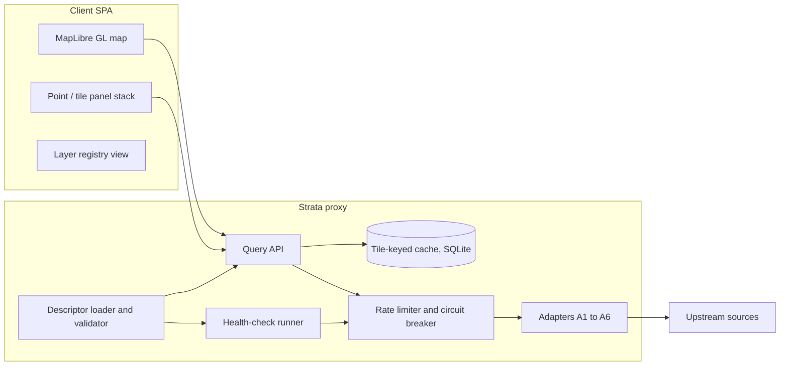

# Strata — Technical Plan
**Status:** proposed v0.1 (companion to [requirements.md](requirements.md) draft v0.2)
**Date:** 2026-08-08

This document turns the requirements into buildable decisions: architecture shape, stack, repository layout, core contracts, and a concrete work breakdown for Phase 0. Positions on the open decisions of requirements §12 live in [decisions.md](decisions.md); this plan assumes the recommendations there (in particular D1: thin server proxy) and must be revised if they change.

---

## 1. Architecture shape

A two-part system: a **single lightweight server process** ("the proxy") and a **browser SPA** ("the client"). Both live in this repository.



Division of labour:

- **The proxy owns everything with a politeness or correctness obligation**: outbound requests (single `User-Agent` with contact details, R7.5), per-layer rate limiting and circuit breaking (R7.3, R7.6), the tile-keyed cache (R7.2), API keys, health checks and status history (R8.1–R8.5), and descriptor loading/validation (R6.2). Centralising these is the whole argument for the proxy: a pure client cannot enforce a per-layer concurrency cap across browser tabs, cannot hide keys, and cannot run scheduled health checks while nobody is looking.
- **The client owns interaction semantics**: debounced viewport tracking (R7.4), lazy fetch on panel expand / overlay toggle (R7.1), rendering of the three empty states (R5.3), zoom-validity greying (R5.2), aggregation labelling (R4.2), sampled-vs-aggregated marking (A4), and attribution display.
- **Two deliberate exceptions to "everything through the proxy":**
  - **Public tile pyramids** (basemap, GIBS WMTS, PMTiles, historical map overlays) go direct from browser to source. They are designed for browser consumption, cache correctly in the browser, and proxying them would just double bandwidth. The descriptor marks these `direct: true`.
  - **Range-readable assets the user has localised** (downloaded COGs, derived PMTiles) can also be read directly, which is what keeps the offline path (D6) plausible later without an architecture change.
- The proxy is **stateless apart from the cache and status history** until Phase 3. The A5 stream store is deliberately absent from the Phase 0–2 design; when it arrives it is a new subsystem inside the same process (or a sidecar), not a rework of the adapters.

Deployment target: one container / one systemd unit on any small box (home server or cheapest VPS). No horizontal scaling, no external services. A single operator is the load model; simplicity of operation beats throughput everywhere.

## 2. Stack

**TypeScript end-to-end.** One language for proxy, client, and the descriptor/result types shared between them. The alternatives considered:

- *Python server* — strongest raster tooling (rasterio/GDAL), but splits the codebase into two languages and the shared-types benefit is lost exactly where it matters most (the descriptor and result envelope are the project's core contracts).
- *Go server* — attractive for the Phase 3 stream store, but weak COG/geo ecosystem and again no type sharing. Revisit only if the Node stream store actually falls over.
- *Pure-client TypeScript* — rejected with D1 (see decisions.md).

Chosen components, with the reason each earns its place:

| Concern | Choice | Why |
|---|---|---|
| Map rendering | **MapLibre GL JS** | Open-source vector-tile WebGL renderer; the default choice for OSM-based work. Also the answer to "prototype salvage" — see D9. |
| Basemap | OpenFreeMap or self-hosted PMTiles from Protomaps builds | No key, no usage terms to babysit; self-hosting is one file |
| Client framework | **Svelte 5 + Vite** | Small, fast, no ecosystem lock-in needed since the heavy lifting is MapLibre's. React acceptable if contributor familiarity ever matters; it won't (single operator). |
| Server | **Node + Fastify** | Boring, fast enough, first-class TypeScript |
| Descriptor validation | **Zod schemas** as the single source of truth; descriptors authored in YAML | Zod gives load-time validation (R6.2/R6.3 mandatory-field enforcement) *and* inferred TS types shared by proxy and client — the contract cannot drift from the code |
| COG reading (A2) | **geotiff.js** in the proxy | Pure-JS range-request COG reads; no GDAL dependency, no native builds |
| Reprojection | **proj4js**, definitions pinned per descriptor | Adapter never guesses CRS (R8.4): the descriptor's `crs` field is the only source, and an unknown EPSG code is a load-time hard error |
| Region geometry (A3) | Region polygon packs stored as **FlatGeobuf or GeoJSON** on disk, point-in-polygon via turf; loaded per region-scheme (NUTS, EAWS, …) | Small, stable, versioned with the repo or fetched once |
| Cache + status history | **SQLite** (better-sqlite3), one file | Zero-ops, transactional, fine at single-operator scale; serves R7.2 and R8.5 from the same store |
| Derived tiles (Phase 2) | **PMTiles** (R9.1) via tippecanoe offline | Single file, range-readable, no tile server |
| Testing | **Vitest**; recorded upstream fixtures for adapter tests | Health assertions (R8.1) double as integration tests against live endpoints, run separately from the fixture-based unit suite |

## 3. Repository layout

```
strata/
  docs/                  requirements, plan, decisions, per-layer research notes
  layers/                *.yaml layer descriptors — the catalogue as configuration
  regions/               region polygon packs for A3 (NUTS, EAWS, …)
  packages/
    core/                shared contracts: descriptor schema (zod), result envelope,
                         tile math, unit scaling — no I/O, no DOM, fully unit-tested
    proxy/               Fastify server: adapters, limiter, cache, health runner
    client/              Svelte + MapLibre SPA
```

Descriptors live at the repo root, not inside a package: they are content, not code, and the promise of §6 is that most future work happens only in `layers/`.

## 4. Core contracts

These are the interfaces Phase 0 exists to get right. Sketches, not final code — but the *shapes* are commitments.

### 4.1 Adapter interface

```ts
interface Adapter {
  point(layer: LayerDescriptor, lonLat: [number, number]): Promise<LayerResult>;
  tile(layer: LayerDescriptor, tile: TileId): Promise<LayerResult>;   // only if 'tile' ∈ modes
  overlaySpec(layer: LayerDescriptor): OverlaySpec | null;            // how the client renders M3
}
```

One implementation per adapter class (A1–A6), zero implementations per layer (R6.1). `tile()` is **not** implemented as sampling `point()` (§2 key requirement); each adapter implements the aggregation functions its data shape supports, and the descriptor selects among them (R4.1). If a layer seems to need code, the fix is a new descriptor field with defined semantics, and that pressure is exactly what the three Phase 0 probe layers are for.

### 4.2 Result envelope

Every query, from every adapter, returns the same envelope. This is where R4.2, R5.3, R6.4 and the A4 sampled-marking rule become structural rather than a matter of UI discipline:

```ts
type LayerResult =
  | { status: 'ok';
      value: Scalar | Histogram | FeatureCollection;
      aggregation: AggregationId;        // which declared function produced this (R4.2)
      basis: 'aggregated' | 'sampled' | 'nearest';  // A4 rule + R4.4, machine-readable
      unit: string;                       // post-scaling display unit (R6.3)
      fetchedAt: string; cacheHit: boolean;
      attribution: Attribution;          // rides with every result, so the UI cannot forget it
      provenance: string }               // R6.4
  | { status: 'empty' }                  // coverage exists, genuinely nothing here (information)
  | { status: 'no_coverage' }            // dataset does not include this territory (a gap)
  | { status: 'zoom_invalid'; reason: string }        // R5.1/R5.2
  | { status: 'error'; kind: 'upstream' | 'timeout' | 'schema' | 'rate_limited' }
  | { status: 'degraded'; ... }          // health assertion currently failing (R8.3)
```

`empty` vs `no_coverage` is decided by the proxy from the descriptor's `coverage` field plus the response — never inferred by the client from an empty feature list.

### 4.3 Query pipeline (proxy side)

```
request → descriptor lookup → zoom_valid gate → coverage gate →
cache lookup (layer id + tile/point key + descriptor version) →
[miss] → per-layer limiter (concurrency, interval, circuit state) →
adapter fetch → unit scaling (scale_factor) → aggregation → envelope → cache write
```

The cache key includes a hash of the descriptor, so editing a descriptor invalidates its cache — a scale-factor fix must never serve stale mis-scaled values (R6.3's failure mode).

### 4.4 Health runner

A scheduler inside the proxy: per layer, at `ttl`-appropriate intervals, run the descriptor's `health_assertion` through the *same* query pipeline (bypassing cache), record pass/fail + latency into SQLite (R8.5), and flip the layer's `degraded` flag (R8.3). Status endpoint `/status` renders the table; the client shows degraded badges. No separate monitoring stack.

## 5. Phase 0 work breakdown

Goal restated: build the skeleton against three deliberately different layers — **Overpass (A1), SoilGrids pH (A2), ENTSO-E generation mix via Energy-Charts (A3)** — so the descriptor and adapter contracts are forced honest before the catalogue grows. Milestones are sequential; each has acceptance criteria tied to requirement numbers.

**M0.1 — Contracts package.**
Zod descriptor schema with mandatory-field validation; result envelope types; tile math (XYZ ↔ bbox, quadkey); unit scaling helper.
*Accept:* a descriptor missing `licence`, `attribution`, or (for numeric layers) `unit`/`scale_factor` fails to load with a precise error (R6.2, R6.3); an unknown `crs` fails hard (R8.4). Unit tests only, no I/O.

**M0.2 — Proxy skeleton + pipeline.**
Fastify app, descriptor loading from `layers/`, query endpoints for M1/M2, cache and limiter with per-layer config, global `User-Agent` with contact email, 429/Retry-After backoff, circuit breaker.
*Accept:* R7.2, R7.3, R7.5, R7.6 demonstrable in tests with a mock upstream (including: second request within `min_interval_ms` queues; repeated failures open the circuit and return `degraded`, not retries).

**M0.3 — First layer end-to-end: SoilGrids (A2).**
geotiff.js COG adapter: overview selection by zoom, windowed range reads, continuous aggregation (mean/min/max/percentiles) and categorical histogram (R4.3, needed immediately after for WorldCover).
*Accept:* soil pH at a known Vienna coordinate returns the documented value within range; the full §13 checklist passes for the layer; tile query at z6 returns `zoom_invalid` with reason (R5.2).

**M0.4 — Second layer: Overpass (A1).**
BBOX vector adapter with Overpass QL templating from the descriptor, capped feature lists, count/density aggregation. This is the politeness stress test — the limiter from M0.2 must demonstrably protect Overpass.
*Accept:* an OSM POI descriptor (e.g. drinking fountains) works in M1 and M2; a query in the open ocean returns `empty`, not `no_coverage` and not `error` (R5.3 distinction).

**M0.5 — Third layer: ENTSO-E / Energy-Charts (A3).**
Region-lookup adapter: point → bidding-zone polygon (from `regions/`) → fetch by zone ID. First layer where the "tile" answer is a region answer — the envelope must carry which region answered.
*Accept:* clicking anywhere in Austria returns the current AT generation mix; clicking in the Atlantic returns `no_coverage` (R5.3 case 1, correctly distinguished from M0.4's `empty`).

**M0.6 — Health runner.**
Scheduler, assertion execution, SQLite status history, `/status` endpoint, degraded flag in query responses.
*Accept:* R8.1–R8.3, R8.5; sabotaging a descriptor's endpoint URL flips the layer to degraded within one cycle without user traffic.

**M0.7 — Minimal client.**
MapLibre map + crosshair/click; the M1 panel stack for the three layers; per-result attribution line; aggregation label on expand (R4.2); provenance note (R6.4); distinct rendering for all envelope states (R5.2, R5.3); zoom-validity greying; debounced movement, lazy fetch (R7.1, R7.4).
*Accept:* a stranger can click anywhere and correctly explain, for each of the three layers, what they are seeing and why a panel is grey/empty/erroring — the §5 semantics survive contact with the UI.

**M0.8 — Exit review.**
Re-read §6 against what M0.3–M0.5 actually required. Any bespoke code that crept in becomes either a descriptor field or a named adapter capability. Then freeze descriptor schema v1 and write the layer-authoring guide (`docs/adding-a-layer.md`, essentially §13 operationalised).

Phase 0 is done when adding a *fourth* layer (suggested dry run: WorldCover, exercising the categorical path of A2) touches only `layers/` and takes under an hour including the §13 checklist.

**Explicitly not in Phase 0:** M3 overlays beyond a stub (`overlaySpec` may return null for all three probe layers), A4/A5/A6 adapters, offline behaviour, any second layer per adapter beyond the exit dry-run, auth of any kind.

## 6. Phase 0 risks

| Risk | Mitigation |
|---|---|
| geotiff.js can't cleanly read a needed COG (odd CRS grid, compression) | Known-good SoilGrids VRT/COG mirrors exist; fall back to a small GDAL-based sidecar for that one adapter before abandoning the JS-only proxy. Prove this in M0.3, which is why A2 goes first. |
| Overpass politeness mistakes during development itself | Develop against a local fixture set recorded once; hit live Overpass only in health assertions and manual checks. Set conservative descriptor limits from day one. |
| ENTSO-E API friction (token, XML) | Energy-Charts is the planned wrapper; keep the descriptor pointing at whichever survives contact. The A3 *adapter* is about region resolution, not this one upstream. |
| Descriptor schema churn after more layers land | Accepted — schema is explicitly frozen only at M0.8, and the cache key already includes descriptor hash so churn can't serve stale shapes. |
| Scope creep toward pretty rendering | M0.7's client is deliberately ugly. Overlay work is Phase 1+. |

## 7. After Phase 0

Phasing follows requirements §11 unchanged. The one sequencing note worth adding: early in Phase 1, build the **generic OGC/WFS client** before hand-adding more A1 layers — it converts INSPIRE's dozens of national services into descriptor-only work, which is the leverage the whole plan is betting on.
